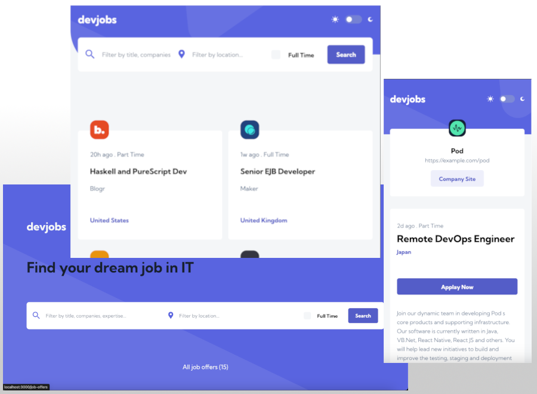

# Frontend Mentor - Devjobs web app solution

This is a solution to the [Devjobs web app challenge on Frontend Mentor](https://www.frontendmentor.io/challenges/devjobs-web-app-HuvC_LP4l). Frontend Mentor challenges help you improve your coding skills by building realistic projects.

## Table of contents

- [Overview](#overview)
  - [The challenge](#the-challenge)
  - [Screenshot](#screenshot)
  - [Links](#links)
- [My process](#my-process)
  - [Built with](#built-with)
  - [What I learned](#what-i-learned)
  - [Continued development](#continued-development)
- [Run project](#run-project)
- [Author](#author)

## Overview

### The challenge

Users should be able to:

- View the optimal layout for each page depending on their device's screen size
- See hover states for all interactive elements throughout the site
- Be able to filter jobs on the index page by title, location, and whether a job is for a full-time position
- Be able to click a job from the index page so that they can read more information and apply for the job
- Have the correct color scheme chosen for them based on their computer preferences.

### Screenshot



### Links

- Solution URL: [GitHub](https://github.com/michalrudy9/Devjobs-App-NextJS)
- Live Site URL: [Vercel](https://devjobs-app-next-js.vercel.app/)

## My process

### Built with

- [NextJS](https://nextjs.org)
- [React](https://react.dev)
- [TypeScript](https://www.typescriptlang.org)
- [Tailwind](https://tailwindcss.com)
- [Readux Toolkit](https://redux-toolkit.js.org)
- [Tanstack Query](https://tanstack.com/query/latest)
- [Vercel PostgreSQL](https://vercel.com/docs/storage/vercel-postgres)
- [MUI Material](https://mui.com)
- [Framer Motion](https://www.framer.com/motion/)
- Semantic HTML5 markup
- Mobile-first workflow
- Flexbox
- CSS Grid

### What I learned

#### Fetching data via Route Handlers

Route Handlers allow you to create custom request handlers for a given route using the Web Request and Response APIs. For instance you can fetch data from database like PostgreSQL.

```
...
api/
    all-job-offers/
                      route.ts
    amount-job-offers/
                      route.ts
...
```

To retrieve data from the database from the client side, I used route handlers, which contain a specific HTTP method to retrieve specific data from the database. `all-job-offers` describes the subpath where the defined instructions will be contained, in this case to download all job offers (target `route.ts` file). To execute a request in the fetch function, the domain address is combined with the defined path, creating a url: `http://localhost:8080/all-job-offers/`.

`route.ts`

```ts
import { QueryResult, QueryResultRow, sql } from "@vercel/postgres";

export const dynamic = "force-dynamic";
export const GET = async (): Promise<Response> => {
  let response = {} as QueryResult<QueryResultRow>;
  try {
    response = await sql`SELECT * FROM job_offer_header`;
  } catch (error) {
    throw new Error("An error occurred while fetching job offers!");
  }

  return Response.json(response.rows);
};
```

#### Redux hooks in NextJS

To execute the dispatch method and selector in the nextjs application, I defined own useDispatch and useSelector hooks which are named as `useAppDispatch` and `useAppSelector`.

`store/hooks.ts`

```ts
export const useAppDispatch: () => AppDispatch = useDispatch;
export const useAppSelector: TypedUseSelectorHook<RootState> = useSelector;
```

### Continued development

There are some features which I would provide to develop project to full stack application.

1. I would like to make an arrow in the view of the selected job offer. This solution would allow you to return to the list of job offers.
2. Add a load more job offers function for button and execute when will be click.
3. Add a layout files for all pages with metadata like title, description, lang and so on.
4. Add a save to local storage with user preferences like colors mode or searched job offers parameters.
5. Next will be expand app by ability sing up form and login to created account. It will be two types of users company and candidate. Company could be adding job offers announcement and user can apply for a job.
6. The last change will be the reconstruction of the database structure for new functions such as registration and login.

## Run project

This is a [Next.js](https://nextjs.org/) project.

To run app locally (on your computer) you have to do some changes. <br><br>In `OfferHeader.tsx` file change line

```ts
const src: string =
  "https://devjobs-app-next-js.vercel.app/logos/" + jobOffer.logo + ".svg";
```

to

```ts
const src: string = "https://localhost:{port}/logos/" + jobOffer.logo + ".svg";
```

The same change should be in `JobOffreItem.tsx` file!

Next step is run command:

```bash
npm install

npm run dev
```

The last step is open any browser and type in url:

```ts
https://localhost:{port}/
```

## Author

- Website - [Vercel](https://devjobs-app-next-js.vercel.app/)
- Frontend Mentor - [@michalrudy9](https://www.frontendmentor.io/profile/michalrudy9)
